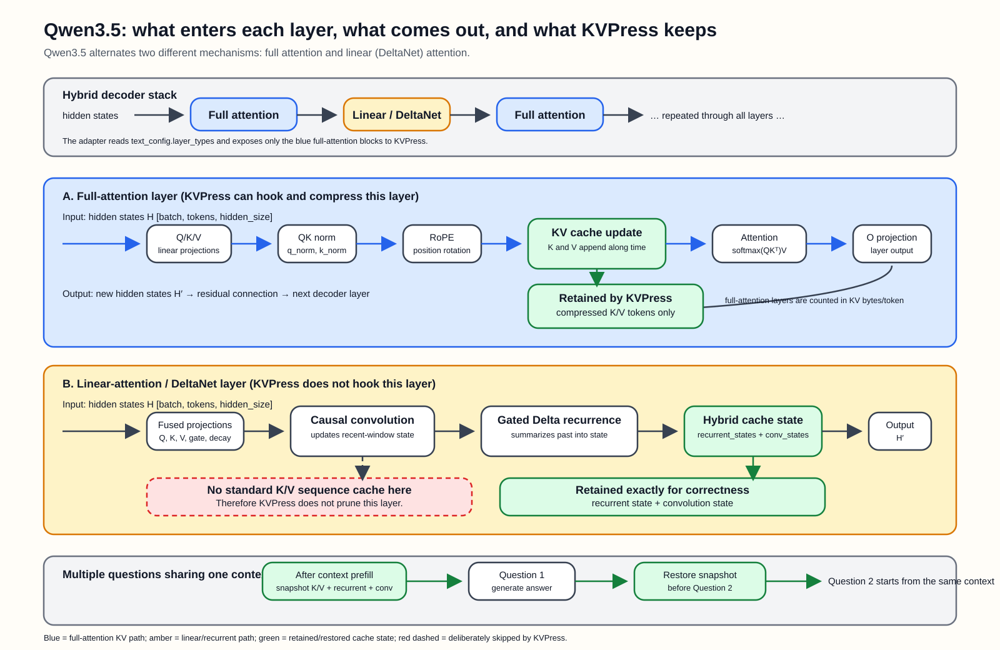

# Qwen3.5 layer and cache flow

## How to read the diagram

- **Blue full-attention layers** receive hidden states, create query/key/value
  projections, apply RoPE, append keys and values to the KV cache, and compute
  attention. KVPress can compress their cached K/V tokens.
- **Amber linear-attention layers** use convolution plus a gated DeltaNet
  recurrence. They maintain `conv_states` and `recurrent_states`, not a normal
  sequence-shaped K/V cache. KVPress skips these layers.
- **Green state** is preserved when several questions share one context. The
  context snapshot contains full-attention K/V plus the linear-attention
  recurrent and convolution states. It is restored after each answer.
- **Red dashed box** marks the state deliberately excluded from KVPress hooks.

The layer output is always the next hidden-state tensor `H'`, which flows into
the next decoder layer and eventually the language-model head.

